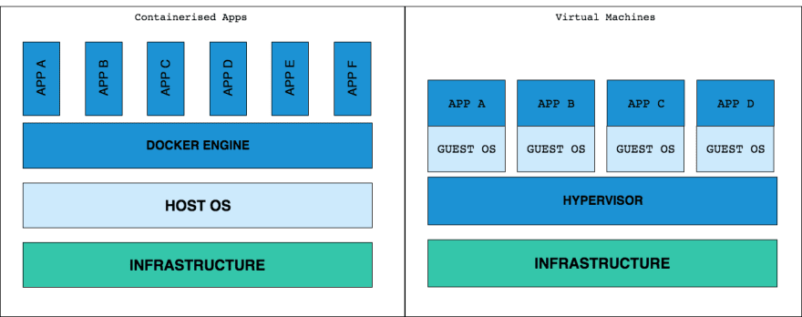
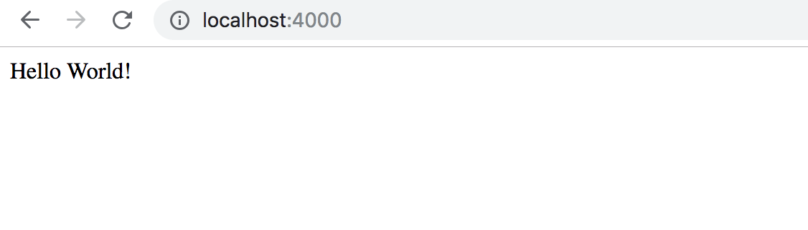

# 为什么我们要用 docker ?

过去的我们，当业务发展需要部署新的应用时，DevOps 小伙伴通常会去买一台服务器，但是却不知道这个新应用具体需要多高的配置，往往都会造成资源浪费。

当虚拟机出现后，它可以让我们在一台服务器上运行多个应用，但是却有一个缺陷。每个 VM 需要运行一整个的操作系统。每个 OS 又需要 CPU、RAM 等等，需要打补丁、安装证书，这些反过来又增加了成本和弹性。

Google 在很久之前就开始使用容器模型来解决 VM 模式的弊端。简单来说容器模型允许我们在同一台主机上运行多个容器，而且共用主机的 CPU、RAM 等资源。

> 那么它对开发者来说意味着是么呢？

它可以保证对所有的开发者和服务器来说，我们的工作环境都是一致的。比如： 生产环境、仿真环境、测试环境。

任何人都可以分分钟配置好项目，无需乱搞配置、安装库和设置依赖。

> 简单来说，docker 是一个平台，它允许我们使用容器来开发、部署、运行应用程序。

让我们退一步来看，容器系统在物理上是什么样子的，以及与 VM 有什么区别。



可以看出来，宿主机的资源在容器化的使用后是共享的，但是在 VM 中却被分割开了。

接下来，我们来深入一些。

# 如何使用 docker ?

为此我们需要先熟悉一些术语。


**Docker image**: 它是一个可执行文件，包含了运行一个应用程序的操作系统配置和所有的库。它有多个层叠在一起，并表示为单个对象。docker image 是通过 *docker file* 来创建的，我们稍后再讲。

**Docker Container**: 它是 docker image 的一个运行实例。同一个 docker image 可以有多个运行的 container。

# 容器化 Node.js 应用

我们来尝试容器化一个简单的 node.js 应用，然后创建一个 image：

## 你的 Node.js 应用

先创建一个 `my-node-app` 文件夹，

```
mkdir my-node-app
cd my-node-app
```

然后创建一个 `index.js` 来启动一个 node server:

```js
// 我们用 require 引入 express

var express = require('express')

var app = express()

// 对根 URL 做一个响应
app.get('/', function (req, res) {  
 res.send('Hello World!')  
})

// 让服务器监听 8081 端口
app.listen(8081, function () {  
  console.log('app listening on port 8081!')  
})
```

然后我们创建一个 `package.json` 文件，可以通过 `npm init -y` 来快速生成：

```json
 {

    "name": "helloworld",  
    "version": "1.0.0",  
    "description": "Dockerized node.js app",  
    "main": "index.js",  
    "author": "",  
    "license": "ISC",  
    "dependencies": {  
      "express": "^4.16.4"  
    }
 }
```

到这一步我们甚至不需要 express 或者 npm 安装在自己的机器，因为 dockerfile 可以为我们配置和安装这些依赖。

## DockerFile

让我们创建一个 dockerfile，然后保存到 `my-node-app` 文件夹。这个文件没有扩展名，它的名字就叫作 `Dockerfile`，这是里面的内容：

```
# Dockerfile
FROM node:8
WORKDIR /app
COPY package.json /app
RUN npm install
COPY . /app
EXPOSE 8081
CMD node index.js
```

下面解释一下里面的命令：

`FROM node:8` -- 从 docker hub 拉取 node.js docker 镜像，可以在这里找到 node 的镜像：<https://hub.docker.com/_/node/>

`WORKDIR /app` -- 设置镜像中的工作目录，可以与下面的命令一起使用： `COPY`，`RUN` 和 `CMD`

`COPY package.json /app` -- 将 package.json 从宿主机的 `my-node-app` 目录复制到了镜像中的 `/app` 目录

`RUN npm install` -- 在镜像中运行此命令来安装 node 包

`COPY . /app` -- 复制 `my-node-app` 目录中的所有文件到镜像中的 `/app` 目录

`EXPOSE 8081` -- 这条命令告诉 container 要暴露一个端口号，这个端口号正是我们在 `index.js` 中写的那个。默认情况下，容器会忽略对它所有的请求。

## 构建 Docker 镜像

注意看啦~ 打开控制台，到 `my-node-app` 目录下，执行以下命令：

```
 # Build a image docker build -t <image-name> <relative-path-to-your-dockerfile>

 docker build -t hello-world .
```

这条命令在我们宿主机创建了一个 `hello-world` 镜像

`-t` 用来为我们的镜像指定一个名字，这里就是 `hello-world`

`.` 是用来指明 docker file 的路径，由于我们已经在 `my-node-app` 中，所以路径用 `.` 就可以了

你可以在控制台看到类似于以下的输出：

```
Sending build context to Docker daemon  4.096kB  
Step 1/7 : FROM node:8  
 ---> 4f01e5319662  
Step 2/7 : WORKDIR /app  
 ---> Using cache  
 ---> 5c173b2c7b76  
Step 3/7 : COPY package.json /app  
 ---> Using cache  
 ---> ceb27a57f18e  
Step 4/7 : RUN npm install  
 ---> Using cache  
 ---> c1baaf16812a  
Step 5/7 : COPY . /app  
 ---> 4a770927e8e8  
Step 6/7 : EXPOSE 8081  
 ---> Running in 2b3f11daff5e  
Removing intermediate container 2b3f11daff5e  
 ---> 81a7ce14340a  
Step 7/7 : CMD node index.js  
 ---> Running in 3791dd7f5149  
Removing intermediate container 3791dd7f5149  
 ---> c80301fa07b2  
Successfully built c80301fa07b2  
Successfully tagged hello-world:latest
```

可以看到，它根据 docker file 中的命令依次运行，然后输出了一个 docker 镜像。当你第一次运行的时候可能会需要一些时间，下次就可以使用缓存来加快速度了。现在我们来看下刚才 build 的镜像：

```
 # Get a list of images on your host 
 docker images
```

这个命令会显示在你电脑上存在的 docker 镜像。其中会有一条：

```
REPOSITORY    TAG      IMAGE ID      CREATED         SIZE  
hello-world   latest   c80301fa07b2  22 minutes ago  896MB
```

## 运行 Docker 容器

既然我们已经创建了镜像，下面我们就从这个镜像运行一个 docker 容器：

```
# Default command for this is docker container run <image-name>  
 docker container run -p 4000:8081 hello-world
```

这条命令用来创建和运行一个 docker 容器

`-p 4000:8081` -- 是一个发布（publish）标识，它将本机的 4000 端口映射到了容器中的 8081 端口。现在所有对本机 4000 端口的访问，都会被容器中的 8081 端口监听。

`hello-world` -- 这个名字就是刚才用 `docker build` 命令时指定的镜像名称。

你将会得到以下输出：

```
app listening on port 8081!
```

如果你需要进入容器并且挂载一个 bash 终端，可以运行：

```
# Enter the container
docker exec -ti <container id> /bin/bash
```

为了检查我们的容器是否运行，打开另一个命令行，然后输入：

```
docker ps
```

可以看到以下输出：

```
 CONTAINER ID    IMAGE        COMMAND                  CREATED    
 `<container id>`  hello-world  "/bin/sh -c 'node in…"   11 seconds ago

 STATUS              PORTS                    NAMES  
 Up 11 seconds       0.0.0.0:4000->8081/tcp   some-random-name
```

这里可以看我们从 hello-world 镜像创建的容器，以及它的 `<container id>` ，它正在运行，并且监听了 8081 端口号。

现在我们这个简单的 Node.js 应用就已经完全容器化了。你可以在浏览器访问 [http://localhost:4000](http://localhost:4000/) ，应该可以看到以下画面：



看，是不是很简单哈哈~

[原文链接](https://savokiss.com/tech/docker-for-frontend-developers.html)