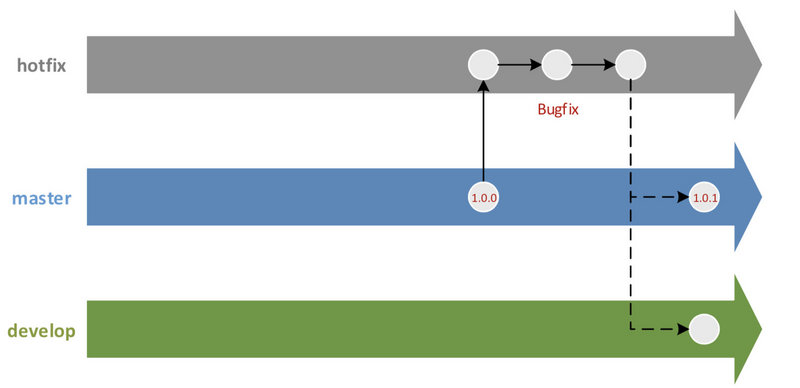

**Git 仓库申请流程**

1. 开发主管向 Git 管理员提交 Git 仓库申请【邮件:发送给 Git 管理员，抄送给项目经理，申请表可向 Git 管理员获取】
2. Git 管理员审批开发主管的申请，审批以下具体信息:
   1. 审批邮件是否抄送给项目经理
   2. 申请的 Git 仓库名称是否符合命名规范
3. 若审批通过，则 Git 管理员完成以下任务:
   1. 创建 Git 仓库
   2. 设置开发主管为 Git 仓库的 Master 角色(管理员，具有该 Git 仓库的管理权限)
   3. 将 Git 仓库地址告知开发主管【邮件:发送给开发主管，抄送给项目经理】
4. 若审批不通过，则驳回申请【邮件:发送给开发主管，抄送给项目经理】

### 初始化 Git 仓库

#### 第一步:克隆远程仓库

开发主管从 Gitlab 中克隆远程仓库

命令示例:

```
git clone <仓库地址>
```

#### 第二步:提交并推送初始版本

开发主管提交代码初始版本到 master 分支，并推送至 Gitlab 系统


开发主管在 Gitlab 系统中设置 master 分支为 Protectd 分支(保护分支)Protected 分支不允许 Developer 推送代码，但 Master 可以推送代码

命令示例:

```
# 提交本地修改:
git add .
git commit –m “提交日志”
# 推送 master 分支:
git push origin master
```

#### 第三步:创建开发分支

开发主管在 master 分支上创建 develop 分支(开发分支)，并推送至 Gitlab 系统 master


master 分支与 develop 分支一样，有且仅有一个

命令示例:

```
# 从 master 分支上创建 develop 分支: 
git checkout –b develop master
# 推送 develop 分支:
git push origin develop
```

### 开发新功能

开发人员在 develop 分支上实现新功能，包括:新特性与 Bug 修复


命令示例:

```
# 切换到 develop 分支: 
git checkout develop
# 提交本地修改:
git add .
git commit –m “提交日志”
# 推送 develop 分支:
git push origin develop
```

若存在多个新特性可以并行开发，则开发主管可创建一个或多个 feature 分支(特性分支)，命名规范:`feature-分支创建日期-新特性关键字`，例如:`feature-20190919-i18n`


当新特性开发完毕后，开发主管需将 feature 分支合并到 develop 分支，最后需删除 feature 分支

命令示例:

```
# 从 develop 分支上创建 feature 分支:
git checkout –b feature-20190919-i18n develop
# 合并 feature 分支到 develop 分支: git checkout develop
git merge --no-ff feature
# 删除本地 feature 分支:
git branch –d feature-20190919-i18n
# 删除远程 feature 分支:
git push origin :feature-20190919-i18n
```

##### 什么时候需考虑使用 feature 分支?

1. 开发一个独立的新特性(完成时，需合并到 develop 分支)
2. 技术研究与尝试(若失败，可随时删除 feature 分支)
3. 提前实现下一个版本需要开发的特性(可不在本次迭代中发布)

推荐使用 feature 分支，但 feature 分支的生命周期不能跨一次迭代

### 准备发布新版本

开发主管需完成以下任务:

1. 确认 develop 分支上的功能是否开发完毕 
2. 若开发完毕，则创建 release 分支(发布分支)，命名规则:release-分支创建日期-待发布版本号，例如:release-20190919-v1.0.0
3. 首先在 release 分支中升级 Maven 版本号，例如:1.0.0-SNAPSHOT，然后修改 version.ini 文件(便于在部署时查看当前版本号)，最后在 release 分支上做一次提交
4. 通知测试主管可对 release 分支进行测试【邮件:发送给测试经理，抄送给项目经理与团队成员】


命令示例:

```
# 从 develop 分支上创建 release 分支:
git checkout –b release-20190919-v1.0.0 develop
```

### 修复待发布版本中的 Bug

开发人员在 release 分支上修复测试人员提交给自己的 Bug


只允许在 release 分支上修复 Bug，不允许提交任何新特性，开发主管需全程监管

命令示例:

```
# 切换到 release 分支:
git checkout release-20190919-v1.0.0
# 提交本地修改:
git add .
git commit –m “提交日志”
# 推送 release 分支:
git push origin release-20190919-v1.0.0
```

### 发布新版本

#### 第一步:集成测试

测试主管需完成以下任务:

1. 从 release 分支上检出所有代码并搭建集成测试环境
2. 安排测试人员，对 release 分支进行集成测试
3. 通知开发主管当前版本已集成测试完毕【邮件:发送给开发主管，抄送给项目经理】

#### 第二步:冒烟测试

开发主管需完成以下任务:

1. 将 release 分支同时合并到 master 分支与 develop 分支
2. 邮件通知测试主管，对 master 分支进行冒烟测试

#### 第三步:发布新版本

开发主管需完成以下任务:

1. 修改 master 分支上的 Maven 快照版为发布版(去掉 SNAPSHOT 后缀)
2. 添加发布日志(RELEASE.md)
3. 在 master 分支上创建标签，命名规则:tag-日期-版本，例如:tag-20190919-v1.0.0
4. 删除 release 分支
5. 打包并上传 Maven 私服
6. 通知测试主管新版本已发布完毕【邮件:发送给测试主管，抄送给项目经理与 Git 管理员，邮件格式

请找 Git 管理员获取】


命令示例:

```
# 合并 release 分支到 master 分支:
git checkout master
git merge --no-ff release-20190919-v1.0.0
# 合并 release 分支到 develop 分支:
git checkout develop
git merge --no-ff release-20190919-v1.0.0
# 在 master 分支上创建标签:
git tag tag-20190919-v1.0.0
# 删除本地 release 分支:
git branch –d release-20190919-v1.0.0
# 删除远程 release 分支:
git push origin :release-20190919-v1.0.0
```

#### 修复线上 Bug

##### 第一步:创建 hotfix 分支 开发主管需完成以下任务:

1. 从 master 分支某个 tag 上创建一个 hotfix 分支(热修复分支)，命名规则:hotfix-分支创建日期-待

发布版本号，例如:hotfix-20190919-v1.0.1

1. 首先在 hotfix 分支中升级 Maven 版本号(例如:1.0.1-SNAPSHOT)，然后修改 version.ini 文件，最后在

hotfix 分支上做一次提交

1. 指导开发人员完成 Bug 修复
2. 通知测试主管对 hotfix 分支进行测试【邮件:发送给测试主管，抄送给项目经理】


命令示例:

```
# 从某个标签上创建 hotfix 分支:
git branch hotfix-20190919-v1.0.1 tag-20190919-v1.0.0
```

##### 第二步:验证 Bug 是否已修复测试主管需完成以下任务:

1. 验证 Bug 是否已修复
2. 通知开发主管 Bug 已修复【邮件:发送给开发主管，抄送给项目经理】

##### 第三步:创建标签并发布新版本

开发主管需完成以下任务:

1. 将 hotfix 分支同时合并到 master 与 develop 分支
2. 通过测试主管进行冒烟测试

##### 第四步:发布新版本

开发主管需完成以下任务:

1. 修改 master 分支上的 Maven 快照版为发布版(去掉 SNAPSHOT 后缀)
2. 添加发布日志(RELEASE.md)
3. 在 master 分支上创建标签
4. 删除 hotfix 分支
5. 打包并上传 Maven 私服
6. 通知测试主管新版本已发布完毕【邮件:发送给测试主管，抄送给项目经理与 Git 管理员，邮件格式

请找 Git 管理员获取】



命令示例:

```
# 合并 hotfix 分支到 master 分支:
git checkout master
git merge --no-ff hotfix-20190919-v1.0.1
# 合并 hotfix 分支到 develop 分支:
git checkout develop
git merge --no-ff hotfix-20190919-v1.0.1
# 在 master 分支上创建标签:
git checkout master
git tag tag-20190919-v1.0.1
# 删除本地 hotfix 分支:
git branch –d hotfix-20190919-v1.0.1
# 删除远程 hotfix 分支:
git push origin :hotfix-20190919-v1.0.1
```

##### 若无法将 hotfix 分支合并到 master 与 develop 分支时，应该如何发布?

比如:现在 master 分支已经发布了 2.0.0 版本(代码结构发生了很大的变化)，但线上发现了一个 1.0.0 版 本的 Bug，当修改了 Bug后，是无法再合并到 master 与 develop 分支的，开发主管需完成以下任务:

1. 直接在 hotfix 分支上创建标签
2. 删除 hotfix 分支(分支删除了，只要标签还在，版本就可以找得回来)
3. 手工修改 develop 分支中的代码(在后续发布时再合并到 master 分支中)

### 定制化项目

当需要对某项目进行定制化时，可从源项目的 Git 仓库 fork 出一个新的 Git 仓库:


当 fork 后，对 repo1 做出的任何修改，都不会影响到 repo2
在 repo2 中修复了 Bug，可通过 Merge Request 的方式提交给 repo1
在 repo2 中可随时拉取 repo1 中的提交，但 repo1 不能拉取 repo2 中的提交

### 附录

#### Maven 版本号命名规范

格式:Major.Minor.Micro

| 版本       | 说明           |
| ---------- | -------------- |
| Major 版本 | 架构调整       |
| Minor 版本 | 新特性         |
| Micro 版本 | Bug 修复、优化 |

#### Git 分支类型

| 分支                    | 用途         |
| ----------------------- | ------------ |
| master 分支(主分支)     | 稳定版本     |
| develop 分支(开发分支)  | 最新版本     |
| release 分支(发布分支)  | 发布新版本   |
| hotfix 分支(热修复分支) | 修复线上 Bug |
| feature 分支(特性分支)  | 实现新特性   |


#### Gitlab 角色与项目角色对应关系

| Gitlab 角色       | 项目角色   |
| ----------------- | ---------- |
| Owner(拥有者)     | Git 管理员 |
| Master(管理员)    | 开发主管   |
| Developer(开发者) | 开发人员   |
| Reporter(报告者)  | 测试人员   |
| Guest(观察者)     | 其他人员   |

#### Git 管理员与开发主管的职责

| Git 管理员        | 开发主管     |
| ----------------- | ------------ |
| 创建 Git 仓库     | 管理项目分支 |
| 检查 Git 分支规范 | 成员管理     |
| 维护 Gitlab 系统  | 管理标签     |

 